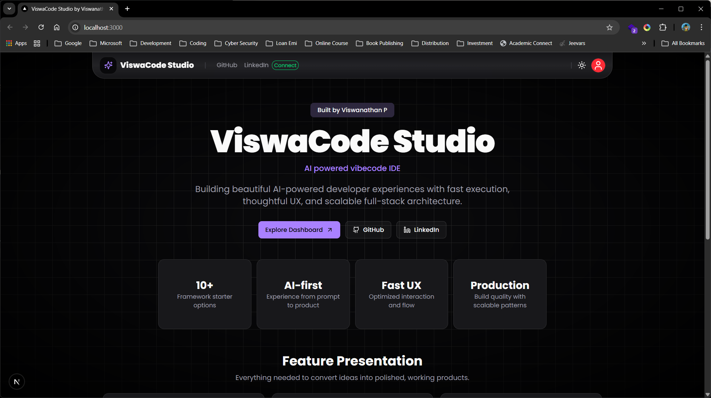
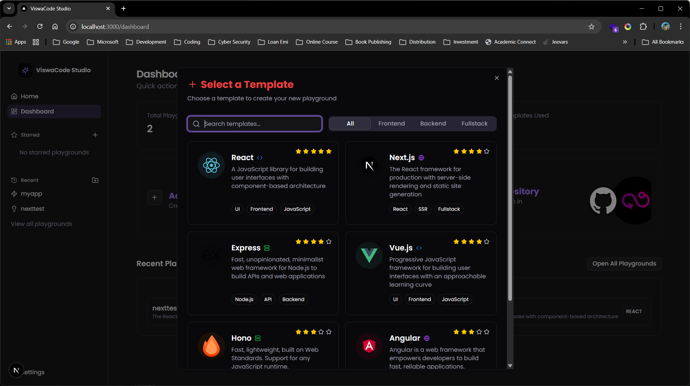
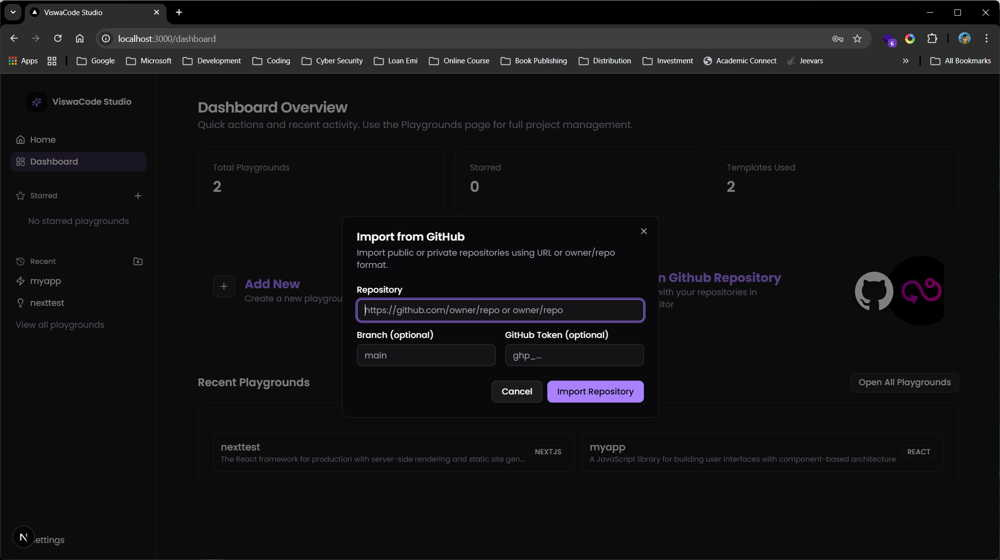
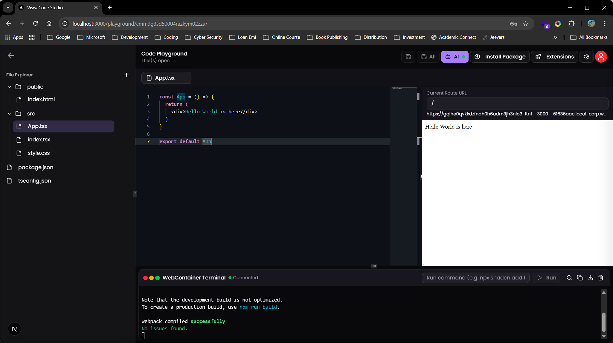

# ✨ ViswaCode Studio — AI-Powered Web IDE
Landing Page

Language Selection

Importing GitHub Repo

Playground with Code Editor, Output, and Terminal


ViswaCode Studio is an AI-first web IDE built by **Viswanathan P** ([drummerviswa](https://github.com/drummerviswa)).
It combines Monaco, WebContainers, terminal workflows, AI assistance, and template-based project bootstrapping in one browser workspace.

## 🚀 Core Features

- Authentication with NextAuth (Google/GitHub)
- Dashboard with project listing, starring, and recent access
- Template-based playground creation (React, Next.js, Express, Hono, Vue, Angular, and more)
- File explorer with create/rename/delete for files and folders
- Monaco editor with syntax highlighting, inline AI suggestions, and keyboard workflows
- Fully resizable IDE panes (sidebar, editor, output, terminal)
- Output preview available by default (even before opening files)
- Route URL viewer/input in output panel (e.g. `/test` → `http://localhost:3000/test`)
- Embedded xterm terminal with command history, command input bar, and package install workflows
- Custom command normalization in terminal/package runner (e.g. `shadcn add ...` → `npx shadcn@latest add ...`)
- AI chat integration with code insertion/run workflows
- Settings page with user profile details
- Focus retention improvements so editor stays active while typing during output/error updates

## 🧩 Editor Extensions (Built-in Install Manager)

The playground includes an in-app extensions dialog with persistent install state.

Available extensions:

- Emmet
- React Snippets
- Tailwind CSS Snippets
- Next.js Snippets
- TypeScript Essentials
- Node/Express Snippets
- HTML/CSS Snippets
- JSON/YAML Snippets

Extra support:

- Emmet Zen Coding for Mithril-style expansions in JS/TS

## 🧱 Tech Stack

- Framework: Next.js 15 (App Router)
- Language: TypeScript
- UI: Tailwind CSS + shadcn/ui + Radix
- Auth: NextAuth + Prisma Adapter
- Editor: Monaco (`@monaco-editor/react`)
- Runtime Sandbox: `@webcontainer/api`
- Terminal: `xterm` + addons
- State: Zustand
- Notifications: Sonner

## ⚙️ Local Setup

### 1) Clone

```bash
git clone https://github.com/Aestheticsuraj234/vibecode-playground.git
cd vibecode-playground
```

### 2) Install dependencies

```bash
npm install
```

### 3) Configure env

Create `.env.local` and set values:

```env
AUTH_SECRET=...
AUTH_GOOGLE_ID=...
AUTH_GOOGLE_SECRET=...
AUTH_GITHUB_ID=...
AUTH_GITHUB_SECRET=...
DATABASE_URL=...
NEXTAUTH_URL=http://localhost:3000
```

### 4) Run dev server

```bash
npm run dev
```

Open `http://localhost:3000`.

## ⌨️ Useful Shortcuts

- `Ctrl + S`: Save active file
- `Ctrl + Space`: Trigger AI suggestion
- `Tab`: Accept inline AI suggestion

## 🙏 Credits

- **Current maintainer / latest iteration:** Viswanathan P ([drummerviswa](https://github.com/drummerviswa))
- **Previous version author:** [Aestheticsuraj234](https://github.com/Aestheticsuraj234)

## 📄 License

MIT (see `LICENSE` if present in repo)
